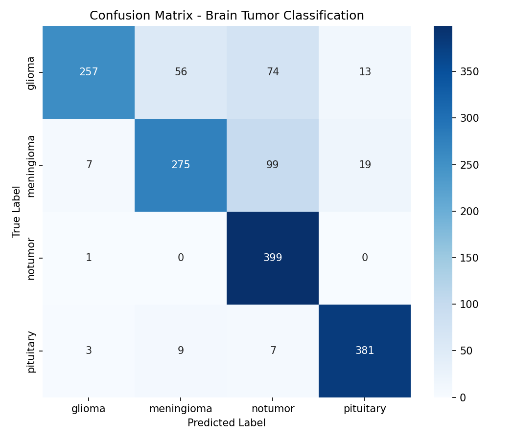

# Brain Tumor Detection Using Convolutional Neural Networks (CNN)

## Project Overview

This project uses a Convolutional Neural Network (CNN) to classify brain MRI images into four categories:

- Glioma
- Meningioma
- Pituitary Tumor
- No Tumor

The model is built using TensorFlow and Keras and can predict the type of brain tumor from an MRI image.

---

## Features

- MRI image classification using CNN
- Four-class prediction
- Image preprocessing and normalization
- Trained deep learning model
- Predicts tumor type with confidence score

---

## Technologies Used

- Python
- TensorFlow
- Keras
- NumPy
- OpenCV
- Matplotlib
- Tkinter
- Spyder IDE

---

## Model Performance

The model was trained on a 4-class MRI dataset (Glioma, Meningioma, Pituitary Tumor, No Tumor) and evaluated on a held-out test set of 1600 images.

### Results

| Metric | Initial Model | Improved Model |
|---|---|---|
| Overall Accuracy | 78.81% | **82.00%** |
| Epochs | 10 (fixed) | Up to 30 (EarlyStopping) |

### Classification Report (Improved Model)

| Class | Precision | Recall | F1-Score |
|---|---|---|---|
| Glioma | 0.96 | 0.64 | 0.77 |
| Meningioma | 0.81 | 0.69 | 0.74 |
| No Tumor | 0.69 | 1.00 | 0.82 |
| Pituitary | 0.92 | 0.95 | 0.94 |

### Improvements Made

- Increased training epochs from 10 to 30 with **EarlyStopping** (patience=5, monitored on validation loss) to prevent overfitting and stop training once performance plateaued
- Added **ModelCheckpoint** to retain the best-performing model on validation accuracy, rather than the final epoch's weights
- Evaluated class distribution across the training set (Glioma: 1400, Meningioma: 1300, No Tumor: 1400, Pituitary: 1400) and confirmed no significant class imbalance

### Known Limitation

The model currently favors predicting "No Tumor" for some borderline cases, resulting in lower recall for Glioma and Meningioma compared to Pituitary. Further improvements could include deeper CNN architectures, batch normalization, or a larger/more diverse training dataset.

See `confusion_matrix.png` and `classification_report.txt` for the full evaluation breakdown.



## Pre-trained Model

The trained model (`brain_tumor_model.keras`) is available for download here:

[Download brain_tumor_model.keras](https://drive.google.com/file/d/1Dq94yM0F14xyLgzfCTz8VA_zF7OgjpB0/view?usp=sharing)
After downloading, place the file in the project root directory before running `brain_tumor.py` for predictions.

---

## Dataset

The project uses a Brain MRI dataset containing four classes:

- Glioma
- Meningioma
- Pituitary
- No Tumor

Dataset Structure:

```
Training/
├── glioma
├── meningioma
├── notumor
└── pituitary

Testing/
├── glioma
├── meningioma
├── notumor
└── pituitary
```

---

## Project Structure

```
BrainTumorProject/
│
├── Training/
├── Testing/
├── train.py
├── brain_tumor.py
├── brain_tumor_model.keras
├── requirements.txt
└── README.md
```

---

## Installation

Install the required libraries:

```bash
pip install tensorflow
pip install numpy
pip install matplotlib
pip install opencv-python
pip install pillow
```

---

## How to Train the Model

Run:

```bash
python train.py
```

After training, the model will be saved as:

```
brain_tumor_model.keras
```

---

## How to Predict

Run:

```bash
python brain_tumor.py
```

Choose an MRI image when prompted.

Example Output:

```
Prediction: Meningioma
Confidence: 98.29%
```

---

## CNN Architecture

- Conv2D (32 Filters)
- MaxPooling2D
- Conv2D (64 Filters)
- MaxPooling2D
- Conv2D (128 Filters)
- MaxPooling2D
- Flatten
- Dense (128)
- Dropout
- Dense (4, Softmax)

---

## Results

- Training Accuracy: ~87.8%
- Validation Accuracy: ~78.8%

---

## Future Improvements

- Improve model accuracy using transfer learning
- Develop a graphical user interface (GUI)
- Deploy as a web application
- Add Grad-CAM visualization for model explainability

---

## Author

**Anuradha Gajendra**

B.Tech (Computer Science & Engineering)

AI/ML Internship Project
